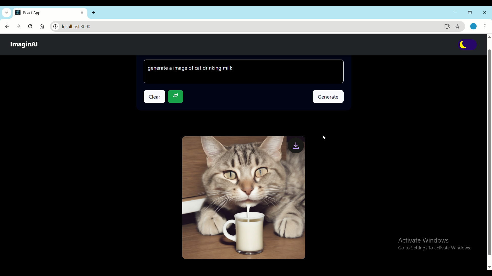

# ImaginAI

Geni AI is an AI-powered web application that allows users to generate images from text prompts and voice recordings. Built using **React** for the frontend and **Node.js** for the backend, the app integrates **Hugging Face** models to bring natural language understanding and image generation capabilities to life.

## ✨ Features

- 🎨 **AI Image Generation**: Enter a text prompt and get a unique AI-generated image in seconds using Hugging Face diffusion models.
- 🎤 **Voice-to-Prompt**: Use your microphone to speak your idea — the app converts your voice into text and generates an image based on the transcription.
- ⚡ **Real-time Interface**: Responsive and fast user interface built with React.
- 🌐 **API Integration**: Node.js backend handles prompt forwarding and Hugging Face model API communication securely.

## 🛠️ Tech Stack

- **Frontend**: React (with Hooks & Context API)
- **Backend**: Node.js (Express)
- **AI Integration**: Hugging Face Transformers and Diffusers
- **Voice Recognition**: Web Speech API or integrated STT (Speech-to-Text) from Hugging Face

## 🚀 Getting Started

### Prerequisites

- Node.js v14+
- npm or yarn
- Hugging Face API key

## 📸 Usage Screenshots

### 🎨 Image Generated from Prompt




### Installation

```bash
git clone https://github.com/yourusername/geni-ai-app.git
cd geni-ai-app


